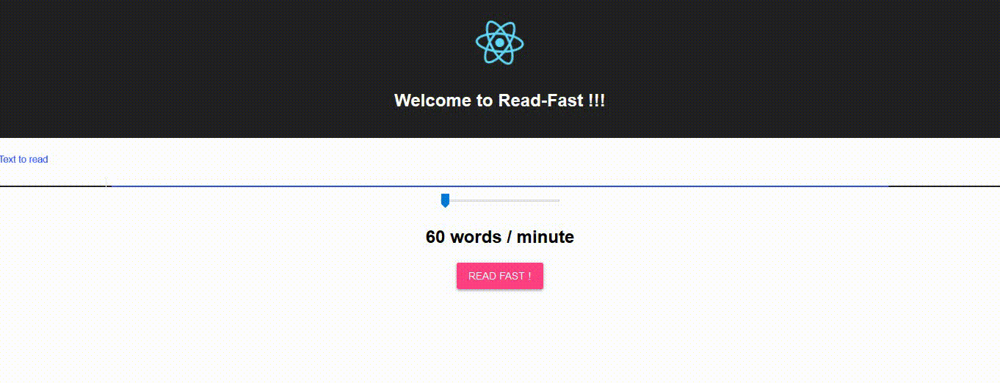

# Read-Fast

This web application was created as a first React experience.
Read-Fast allows you to paste a text and read it word by word.
You can select the speed with a slider from 60 words per minutes to 1000 words per minute.

Test your reading ability, and have fun.

## Installation
```bash
# Clone the repository
git clone https://github.com/kenfire/read-fast.git

# Install dependecies
npm i
# Launch the web page
npm start
```
## TODO
-[ ] Create tests

## Demo
